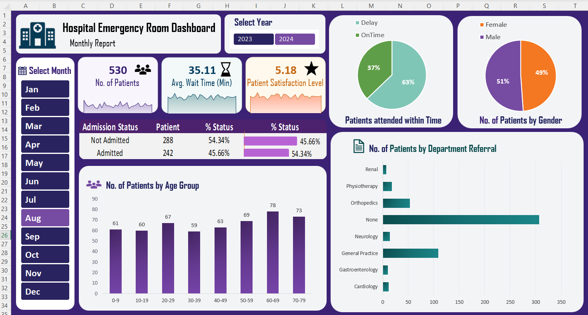

# <h1 align="center">🏥 Hospital Emergency Room Dashboard

An interactive **Hospital Emergency Room Dashboard** built using Microsoft Excel to analyze patient volume, waiting time, satisfaction level, admission status, demographics, and department referrals.

##  Dashboard Preview

---

## 🎯 Project Overview

The purpose of this project is to create an interactive Emergency Room dashboard that provides a clear overview of hospital performance and patient-related metrics.

The dashboard allows users to analyze the data by **year and month** and quickly understand important emergency room trends and patterns.

---

## 📌 Key KPIs

- **Number of Patients** – Total number of patients visiting the Emergency Room.
- **Average Wait Time** – Average time patients wait before receiving medical attention.
- **Patient Satisfaction Level** – Average satisfaction score of patients.

---

## 📈 Dashboard Analysis

The dashboard includes the following analysis:

###  Patient Admission Status

Shows the number and percentage of patients who were:

- Admitted
- Not Admitted

###  Patient Age Distribution

Patients are divided into different age groups:

- 0–4
- 5–14
- 15–29
- 30–44
- 45–59
- 60–69
- 70–79

###  Patient Attendance

Patients are classified based on their waiting time:

- **Within Time** – Waiting time less than 30 minutes
- **Delay** – Waiting time of 30 minutes or more

###  Gender Analysis

Shows the number of patients by:

- Female
- Male

###  Department Referrals

Shows the number of patients referred to different departments, including:

- General Practice
- Orthopedics
- Physiotherapy
- Gastroenterology
- Cardiology
- Neurology
- Renal
- None

---

## Tools & Skills Demonstrated

| Tools / Techniques |
|--------------------|
| Microsoft Excel |
| Power Query |
| DAX |
| Pivot Tables |
| Pivot Charts |
| Slicers |
| Data Cleaning |
| Data Visualization |
| Dashboard Design |

---

## Author & Contact 

### Diksha

**Aspiring Data Analyst**

   )   )

⭐ If you found this project useful, feel free to explore the repository and connect with me!
